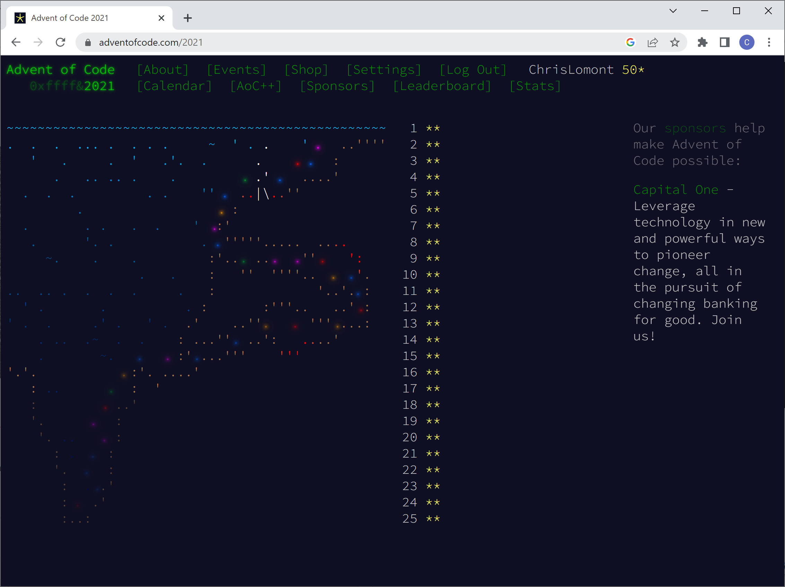
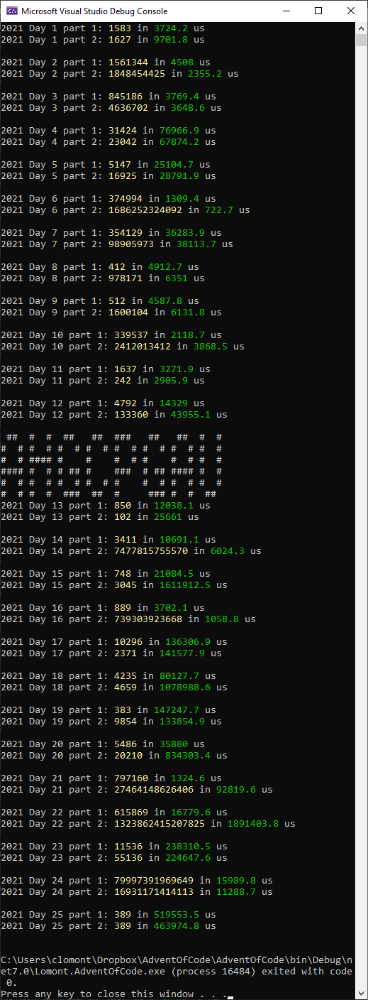

# Advent of code

I was talked into doing Advent of Code 2022, and while doing the first week I also did all of Advent of Code 2021 for practice. These are in C#. I hope to do a blog post about the 2021 problems soon.

Included are solutions to all of 2021 and (so far) day 9 of 2022.

Chris Lomont, Dec 2022

2021 all problems done!

Here's output from my 2021 code:

