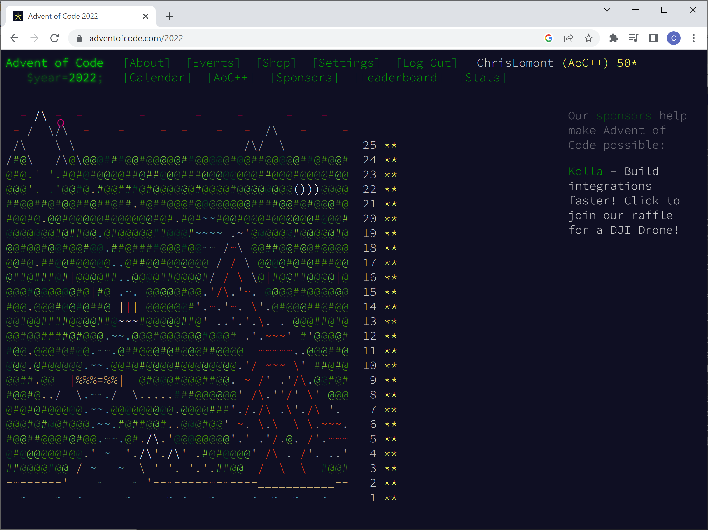
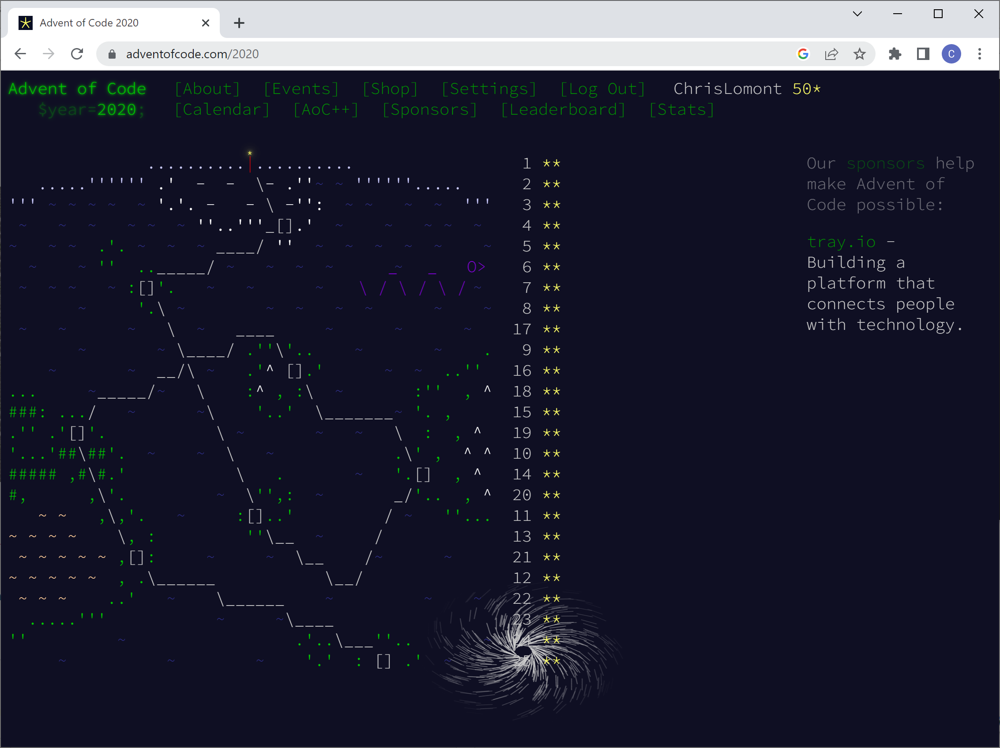
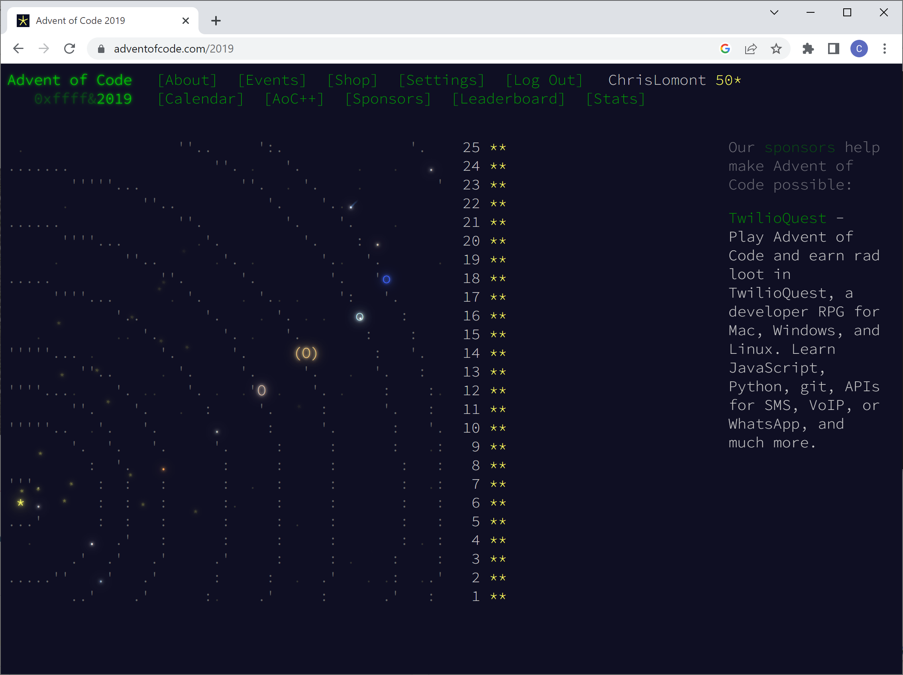
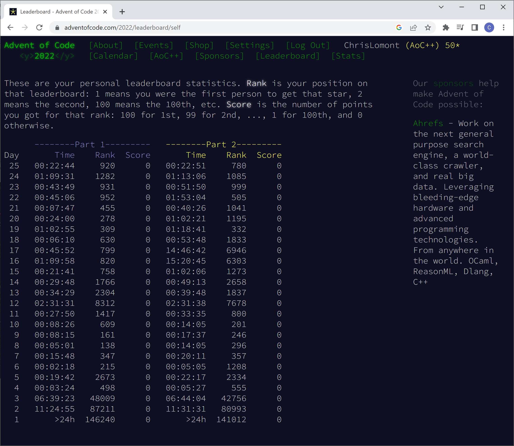
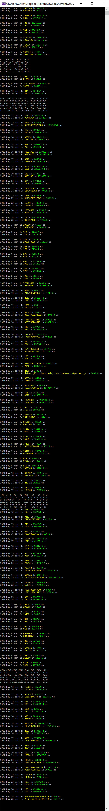

# Advent of code

I was talked into doing Advent of Code 2022, and while doing the first week I also did all of Advent of Code 2021 for practice. These are in C#. I hope to do a blog post about the 2021 problems soon.

- Included are solutions to all of 2021 and (so far) day 9 of 2022.

- Update Dec 24, 2022 - so far I have done the first 24 in 2022, and over the last few weeks for practice I did all of 2019, 2020, and 2021, now all included.
  Update Dec 25, all finished.

Chris Lomont, Dec 2022

- Update Dec 10, 2023, doing AoC 2023, puzzles through day 10 now in.

Chris Lomont, Dec 2023

Problems done 

2022 Results (first time I tried AOC, first few days were done late as I started late)

Output from my code

THE END :)
