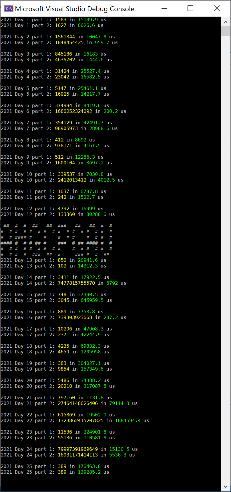

# Advent of code

I was talked into doing Advent of Code 2022, and while doing the first week I also did all of Advent of Code 2021 for practice. These are in C#. I hope to do a blog post about the 2021 problems soon.

Included are solutions to all of 2021 and (so far) day 9 of 2022.

Update Dec 24, 2022 - so far I have done the first 24 in 2022, and over the last few weeks for practice I did all of 2019, 2020, and 2021, now all included.

Chris Lomont, Dec 2022

Problems done (as of Dec24, 2022, tonight is the last for 2022!)

Output from my code

THE END :)
